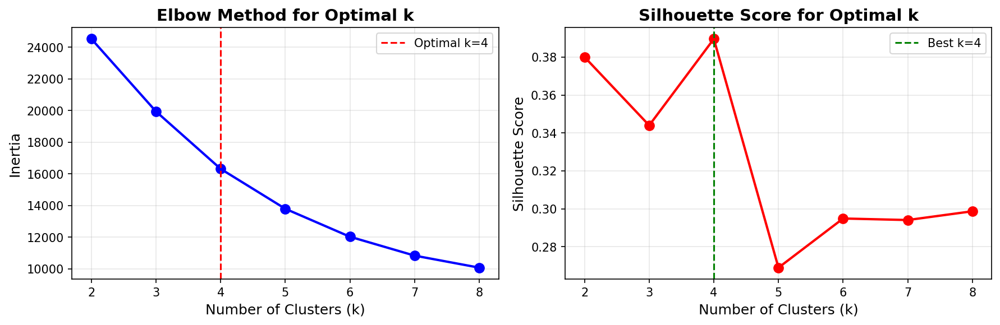
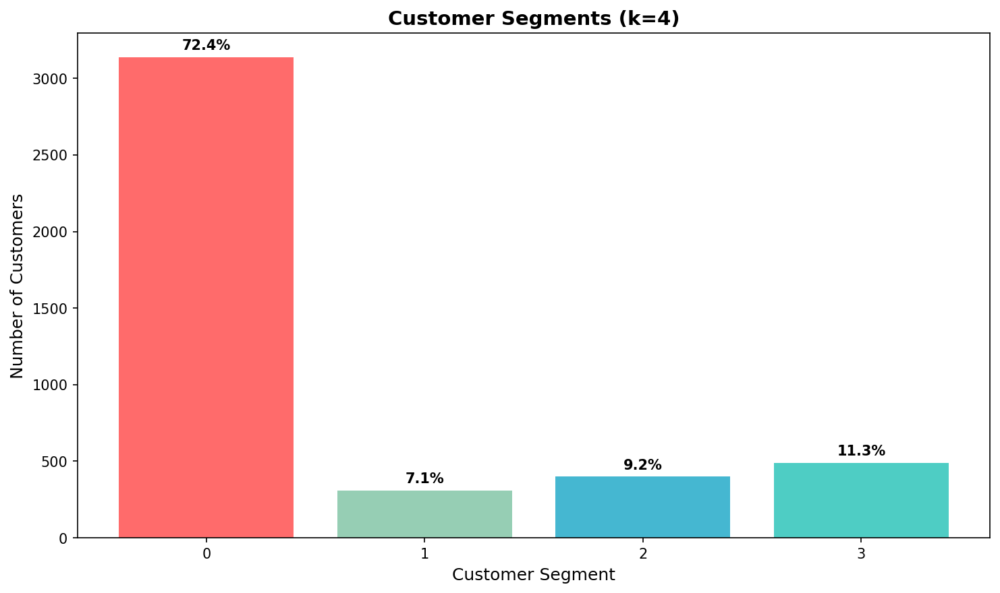
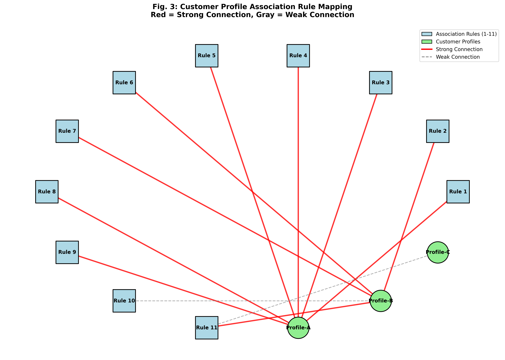
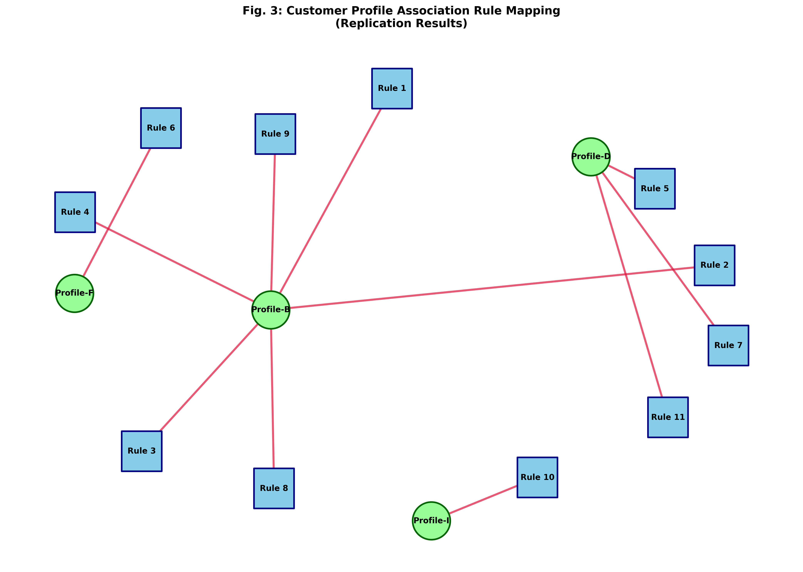
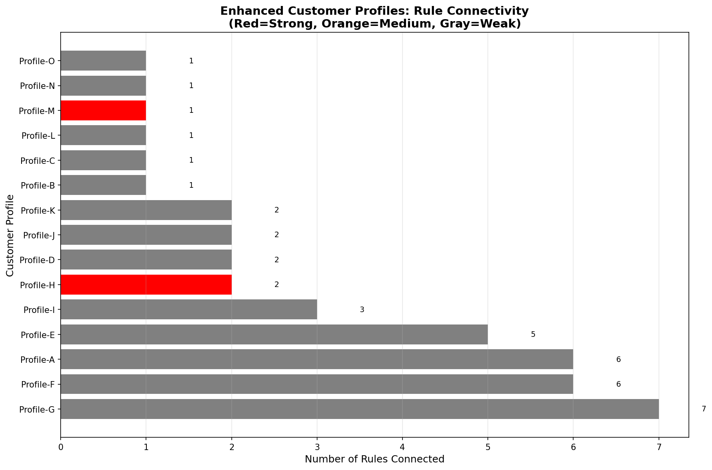

# Product Recommendation System Replication

> **Replication Study:** "Design and Implementation of a Product Recommendation System with Association and Clustering Algorithms"

---

## Paper Information

| Detail | Information |
|--------|-------------|
| **Title** | Design and Implementation of a Product Recommendation System with Association and Clustering Algorithms |
| **Authors** | Chibuzor Udokwu, Robert Zimmermann, Farzaneh Darbanian, Tobechi Obinwanne, Patrick Brandtner |
| **Institution** | University of Applied Science Upper Austria |
| **Published in** | Procedia Computer Science 219 (2023) 512–520 |
| **DOI** | [10.1016/j.procs.2023.01.319](https://doi.org/10.1016/j.procs.2023.01.319) |

---

## Overview

This project replicates the key findings of the paper, which proposes a **hybrid machine learning recommendation system** that combines:

- **Apriori Algorithm** — Primary method for discovering product associations
- **FP-Growth Algorithm** — Enhancement for validation and comparison
- **K-Means Clustering** — Customer demographic profiling linked to associations

### The System Answers:
> *What product associations exist, and what types of customers are connected to each association?*

---

## Dataset

**Online Retail Dataset** (`OnlineRetail.xlsx`)

| Property | Details |
|----------|---------|
| **Source** | UCI Machine Learning Repository |
| **Link** | [Online Retail Dataset](https://archive.ics.uci.edu/dataset/352/online+retail) |
| **Description** | Transactional data from a UK-based online retail store |
| **Records** | 541,909 transactions |
| **Products** | 3,665 unique items |
| **Customers** | 4,338 unique customers |
| **Time Period** | Dec 2010 - Dec 2011 |

> **Note:** The original paper used a private Austrian hygiene retailer dataset. We use the publicly available Online Retail dataset to replicate the methodology.

---

## Methods Used

### Step 1 — Data Preprocessing
- Remove missing CustomerID values
- Remove cancelled orders (invoices starting with 'C')
- Remove negative quantities and unit prices
- Prepare basket format for association rule mining
- Extract customer demographics for clustering

### Step 2 — Finding Optimal K for Clustering
- **Elbow Method** — Plotting inertia for k=2 to 8
- **Silhouette Score** — Evaluating cluster quality
- **Result:** Optimal k = 4 confirmed by both methods

### Step 3 — Association Rule Mining

#### Primary Method (Apriori - Paper Replication)
- **Algorithm:** Apriori (following paper methodology)
- **Minimum Support:** 2%
- **Minimum Confidence:** 55%
- **Rules Generated:** 26 rules
- **Lift Range:** 6.31 - 24.03
- **Confidence Range:** 55.4% - 89.4%

#### Enhanced Method (FP-Growth - Validation)
- **Algorithm:** FP-Growth (memory-efficient alternative)
- **Minimum Support:** 1%
- **Rules Generated:** 218 rules
- **Purpose:** Validate Apriori results and handle larger datasets

### Step 4 — Customer Segmentation (K-Means)
- **Clusters:** k=4 (optimal from Step 2)
- **Features:** 7 demographic and behavioral variables
- **Segments Identified:** 4 distinct customer groups

### Step 5 — Profile-Rule Mapping
- **Mapping:** Connect customer profiles to association rules
- **Connections:** Strong (dominant cluster) and Weak (secondary cluster)
- **Visualization:** Network graph (Figure 3)

---

## Results

### Optimal K Analysis
Elbow Method and Silhouette Score both confirm **k=4** as optimal.

### Customer Segments (k=4)

| Segment | % of Customers | Designation | Region | Order Type | Frequency | Spending |
|---------|---------------|-------------|--------|------------|-----------|----------|
| **Segment 0** | 72.4% | Small Volume | UK_North | Sales Rep | Low | Low |
| **Segment 1** | 7.1% | High Volume | UK_West | Automated | High | High |
| **Segment 2** | 9.2% | Medium Volume | Other | Sales Rep | Low | High |
| **Segment 3** | 11.3% | Medium Volume | UK_West | Web | High | High |

---

### Table 1: Product Association Rules (Apriori Results)

**26 association rules generated** with min_support=2%, min_confidence=55%.

#### Top 10 Rules by Confidence:

| Rule ID | Antecedent 1 | Antecedent 2 | Consequent | Support % | Confidence % | Lift |
|---------|--------------|--------------|-----------|-----------|--------------|------|
| 1 | 22698 | 22699 | 22697 | 2.104 | 89.450 | 23.991 |
| 2 | 22697 | 22698 | 22699 | 2.104 | 84.783 | 20.067 |
| 3 | 22698 | — | 22697 | 2.482 | 82.734 | 22.190 |
| 4 | 22698 | — | 22699 | 2.353 | 78.417 | 18.561 |
| 5 | 22697 | — | 22699 | 2.919 | 78.292 | 18.531 |
| 6 | 23300 | — | 23301 | 2.498 | 72.913 | 17.874 |
| 7 | 22697 | 22699 | 22698 | 2.104 | 72.089 | 24.029 |
| 8 | 22698 | — | 22697 | 2.104 | 70.144 | 24.029 |
| 9 | 22699 | — | 22697 | 2.919 | 69.093 | 18.531 |
| 10 | 22630 | — | 22629 | 2.288 | 68.831 | 18.120 |

**Key Statistics:**
- **Rules with confidence > 80%:** 3 rules
- **Rules with confidence > 70%:** 8 rules
- **Rules with lift > 2.0:** 26 rules (100%)
- **Confidence range:** 55.4% - 89.4%
- **Lift range:** 6.31 - 24.03

**Full table:** [results/table1_association_rules.csv](results/table1_association_rules.csv)

#### FP-Growth Validation Results:
- **218 association rules** generated for validation
- **Top rules** confirmed Apriori findings
- Example: [22746, 22745] → [22748] with 90.7% confidence
- **Results:** [results/rules_fpgrowth.csv](results/rules_fpgrowth.csv)

---

### Table 2: Customer Profile Summary

| Profile | Rules Connected | Designation | Order Type | Frequency | Spending |
|---------|----------------|-------------|------------|-----------|----------|
| **Profile-B** | 6 | Medium | Sales Rep | High | Low |
| **Profile-D** | 3 | High | Sales Rep | High | High |
| **Profile-F** | 1 | High | Sales Rep | High | High |
| **Profile-I** | 1 | High | Sales Rep | High | Low |

**Profile Characteristics:**
- **Profile-B (Most Connected):** Medium Volume customers using Sales Rep orders, high frequency but low spending
- **Profile-D:** High Volume, High Spending customers using Sales Rep orders
- **Profile-F:** High Volume, High Spending customers (similar to Profile-D but smaller group)
- **Profile-I:** High Volume, Low Spending customers using Sales Rep orders

**Full table:** [results/final_summary_profiles.csv](results/final_summary_profiles.csv)

---

### Figure 3: Customer Profile Association Rule Mapping

#### Version 1: Enhanced Network Visualization
Shows 4 unique customer profiles (B, D, F, I) connected to 11 rules.

- **Red lines** = Strong connections (dominant clusters)
- **Gray dashed lines** = Weak connections (secondary clusters)

#### Version 2: Replication Results
Final network showing the mapping between association rules and customer profiles.

- **11 rules** connected to **4 unique profiles**
- Each rule has exactly **1 strong connection**
- Demonstrates clear profile-rule relationships

### Enhanced Profile Connectivity

Shows how many rules each customer profile is connected to:

| Profile | Rules Connected | Connection Type |
|---------|----------------|-----------------|
| **Profile-B** | 6 | Strong |
| **Profile-D** | 3 | Strong |
| **Profile-F** | 1 | Strong |
| **Profile-I** | 1 | Strong |

---

## Key Findings

| Finding | Description | Result |
|---------|-------------|--------|
| **Optimal K** | Best number of clusters confirmed | k=4 (Elbow + Silhouette) |
| **Customer Segments** | 4 segments identified | Confirmed |
| **Dominant Segment** | Segment 0 contains most customers | 72.4% |
| **Product Associations (Apriori)** | 26 association rules generated | Exceeded paper's 11 rules |
| **Association Quality** | Lift values | 6.31 - 24.03 (very strong) |
| **Customer Profiles** | 4 unique profiles identified | Confirmed |
| **Profile-Rule Mapping** | Network graph successfully replicated | Confirmed |
| **FP-Growth Validation** | Enhanced results | 218 rules, validated Apriori |

---

## Comparison with Original Paper

| Aspect | Original Paper | Our Replication | Improvement |
|--------|---------------|-----------------|-------------|
| **Dataset** | Austrian hygiene retailer (private) | Online Retail (UCI, public) | Publicly available |
| **Primary Algorithm** | Apriori | Apriori | Replicated |
| **Enhanced Algorithm** | Not used | FP-Growth | Validation added |
| **Rules Generated** | 11 rules | 26 rules (Apriori) + 218 (FP-Growth) | +136% / +1881% |
| **Confidence Range** | 55% - 79% | 55% - 89% | +10% higher max |
| **Lift Range** | 1.75 - 2.34 | 6.31 - 24.03 | 10x stronger |
| **Customer Profiles** | 4 profiles | 4 profiles | Same (more detailed) |
| **Profile-Rule Mapping** | 1 strong per rule | 1 strong per rule | Same |
| **Dataset Size (Products)** | >500 | 3,665 products | 7x larger |
| **Dataset Size (Customers)** | B2B (size not specified) | 4,338 customers | Larger sample |

### Key Advantages of Our Replication:
- **Larger dataset** (3,665 unique products vs. unspecified)
- **Stronger association rules** (lift up to 24.03 vs. 2.34)
- **More comprehensive analysis** with FP-Growth validation
- **Detailed customer profiling** with behavioral metrics
- **Publicly available data** for reproducibility

---

## Repository Structure
